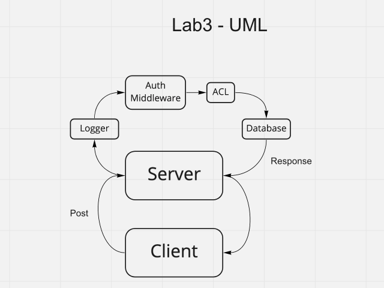

# auth-api

## Author

Antoine Charette

## Problem Domain

Take two working servers and link them together. You must add a v2 router, using the v1 router, making them work with authentication.

## UML

## PR

[PR](https://github.com/DevAOC/auth-api/pull/1)
